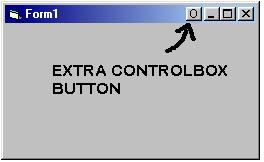

<div align="center">

## Add a button to the ControlBox \(beside the Min, Max and close buttons\)


</div>

### Description

This will add an ADDITIONL button in the ControlBox (beside the the Minmize, Maximize, and Close buttons).
 
### More Info
 
As with any form of subclassing, make sure that you exit the Form by clicking the 'X' in the corner (not the stop button) otherwise it will crash!


<span>             |<span>
---                |---
**Submitted On**   |
**By**             |[Megatron](https://github.com/Planet-Source-Code/PSCIndex/blob/master/ByAuthor/megatron.md)
**Level**          |Advanced
**User Rating**    |4.6 (23 globes from 5 users)
**Compatibility**  |VB 5\.0, VB 6\.0
**Category**       |[Miscellaneous](https://github.com/Planet-Source-Code/PSCIndex/blob/master/ByCategory/miscellaneous__1-1.md)
**World**          |[Visual Basic](https://github.com/Planet-Source-Code/PSCIndex/blob/master/ByWorld/visual-basic.md)
**Archive File**   |[](https://github.com/Planet-Source-Code/megatron-add-a-button-to-the-controlbox-beside-the-min-max-and-close-buttons__1-25041/archive/master.zip)

### API Declarations

See the code below:


### Source Code

```
*ADD THIS SECTION OF CODE TO A MODULE*
**************************************
'-=-=-=-=-=-=-=-=-=-=-=-=-=-=-=-=-=-=-=-=-=-=-=-=-=-=-=-=-=-=-=-=-=-=-=-=-=-=-=-
'|
'| Written By: Megatron
'|
'| E-mail: mega__tron@hotmail.com (yes it's 2 underscores)
'|
'|   The following code snippet will add a fourth icon to the control box (next
'| to the minimize, maximize and close buttons). This button will contain a
'| circle, you can easily modify it so that ANY other graphic can be in its
'| place.
'|
'|   Please E-mail me, as I would love to hear you comments, (be it compliments
'| or critisism).
'|
'-=-=-=-=-=-=-=-=-=-=-=-=-=-=-=-=-=-=-=-=-=-=-=-=-=-=-=-=-=-=-=-=-=-=-=-=-=-=-=-
Public Type POINTAPI
  x As Long
  y As Long
End Type
Public Declare Function Rectangle Lib "gdi32" (ByVal hdc As Long, ByVal X1 As Long, ByVal Y1 As Long, ByVal X2 As Long, ByVal Y2 As Long) As Long
Public Declare Function SelectObject Lib "gdi32" (ByVal hdc As Long, ByVal hObject As Long) As Long
Public Declare Function DeleteObject Lib "gdi32" (ByVal hObject As Long) As Long
Public Declare Function CreateSolidBrush Lib "gdi32" (ByVal crColor As Long) As Long
Public Declare Function CreatePen Lib "gdi32" (ByVal nPenStyle As Long, ByVal nWidth As Long, ByVal crColor As Long) As Long
Public Declare Function Ellipse Lib "gdi32" (ByVal hdc As Long, ByVal X1 As Long, ByVal Y1 As Long, ByVal X2 As Long, ByVal Y2 As Long) As Long
Public Declare Function LineTo Lib "gdi32" (ByVal hdc As Long, ByVal x As Long, ByVal y As Long) As Long
Public Declare Function MoveToEx Lib "gdi32" (ByVal hdc As Long, ByVal x As Long, ByVal y As Long, lpPoint As POINTAPI) As Long
Public Declare Function GetWindowLong Lib "user32" Alias "GetWindowLongA" (ByVal hwnd As Long, ByVal nIndex As Long) As Long
Public Declare Function SetWindowLong& Lib "user32" Alias "SetWindowLongA" (ByVal hwnd As Long, ByVal nIndex As Long, ByVal dwNewLong As Long)
Public Declare Function CallWindowProc Lib "user32" Alias "CallWindowProcA" (ByVal lpPrevWndFunc As Long, ByVal hwnd As Long, ByVal msg As Long, ByVal wParam As Long, ByVal lParam As Long) As Long
Public Declare Function GetWindowDC Lib "user32" (ByVal hwnd As Long) As Long
Public Declare Function ReleaseDC Lib "user32" (ByVal hwnd As Long, ByVal hdc As Long) As Long
Public Declare Function ScreenToClient Lib "user32" (ByVal hwnd As Long, lpPoint As POINTAPI) As Long
Public Declare Function GetAsyncKeyState Lib "user32" (ByVal vKey As Long) As Integer
Public Const GWL_WNDPROC = (-4)
Public Const WM_NCPAINT = &H85
Public Const WM_PAINT = &HF
Public Const WM_SIZE = &H5
Public Const WM_NCLBUTTONDOWN = &HA1
Public Const WM_NCLBUTTONUP = &HA2
Public Const WM_NCHITTEST = &H84
Public Const WM_NCACTIVATE = &H86
Public Const WM_ACTIVATEAPP = &H1C
Public Const WM_ACTIVATE = &H6
Public Const WM_NCMOUSEMOVE = &HA0
Public Const WM_MOUSEMOVE = &H200
Public Const WM_NCLBUTTONDBLCLK = &HA3
Public WndProcOld As Long
Public gSubClassedForm As Form
Private bPressed As Boolean
'LOWORD and HIWORD are needed to extract point values from lParam
Public Function LoWord(ByVal LongVal As Long) As Integer
  LoWord = LongVal And &HFFFF&
End Function
Public Function HiWord(ByVal LongVal As Long) As Integer
  If LongVal = 0 Then
    HiWord = 0
    Exit Function
  End If
  HiWord = LongVal \ &H10000 And &HFFFF&
End Function
Public Function WindProc(ByVal hwnd As Long, ByVal wMsg As Long, ByVal wParam As Long, ByVal lParam As Long) As Long
  Dim lWidth As Long
  Dim POINTS As POINTAPI
  'Draw the button whenever on any event that will cause it to erase
  If wMsg = WM_PAINT Or wMsg = WM_ACTIVATE Or wMsg = WM_ACTIVATEAPP Or wMsg = WM_NCACTIVATE Or wMsg = WM_NCPAINT Or (wMsg = WM_SIZE And wParam <> 1) Then
    DrawControlBox hwnd, RGB(192, 192, 192), vbBlack, RGB(128, 128, 128), vbWhite, RGB(224, 224, 224), 0
  End If
  'Draws an "inverted" form of the button when it's pressed
  If wMsg = WM_NCLBUTTONDOWN Then
    lWidth = gSubClassedForm.Width / Screen.TwipsPerPixelX
    MakeClientPoints hwnd, lParam, POINTS
    If (POINTS.x > (lWidth - 80)) And (POINTS.x < (lWidth - 60)) Then
      DrawControlBox hwnd, RGB(192, 192, 192), vbWhite, RGB(224, 224, 224), vbBlack, RGB(128, 128, 128), 1
      bPressed = True
      Exit Function
    End If
  End If
  'Resets the original colors when the mouse is unpressed
  If wMsg = WM_NCLBUTTONUP Then
    DrawControlBox hwnd, RGB(192, 192, 192), vbBlack, RGB(128, 128, 128), vbWhite, RGB(224, 224, 224), 0
    lWidth = gSubClassedForm.Width / Screen.TwipsPerPixelX
    MakeClientPoints hwnd, lParam, POINTS
    If (POINTS.x > (lWidth - 74)) And (POINTS.x < (lWidth - 60)) Then
      If bPressed = True Then
        bPressed = False
        Call gSubClassedForm.ControlBoxClick
      End If
      Exit Function
    End If
    bPressed = False
  End If
  If wMsg = WM_NCHITTEST And GetAsyncKeyState(vbLeftButton) Then
    lWidth = gSubClassedForm.Width / Screen.TwipsPerPixelX
    MakeClientPoints hwnd, lParam, POINTS
    If (POINTS.x > (lWidth - 74)) And (POINTS.x < (lWidth - 60)) And (POINTS.y < 0) And (POINTS.y > -20) Then
      DrawControlBox hwnd, RGB(192, 192, 192), vbWhite, RGB(224, 224, 224), vbBlack, RGB(128, 128, 128), 1
    Else
      DrawControlBox hwnd, RGB(192, 192, 192), vbBlack, RGB(128, 128, 128), vbWhite, RGB(224, 224, 224), 0
    End If
  End If
  If wMsg = WM_NCLBUTTONDBLCLK Then
    lWidth = gSubClassedForm.Width / Screen.TwipsPerPixelX
    MakeClientPoints hwnd, lParam, POINTS
    If (POINTS.x > (lWidth - 74)) And (POINTS.x < (lWidth - 60)) Then Exit Function
  End If
  WindProc = CallWindowProc(WndProcOld&, hwnd&, wMsg&, wParam&, lParam&)
End Function
'Converts screen coordinates of a DWORD to a point structure, of a client
Sub MakeClientPoints(ByVal hwnd As Long, ByVal pts As Long, PT As POINTAPI)
  PT.x = LoWord(pts)
  PT.y = HiWord(pts)
  ScreenToClient hwnd, PT
End Sub
'********************************************************************************
'FUNCTION:   DrawControlBox
'ARGUMENTS:   hwnd    handle of window to draw on to
'        bGround   Background color of button
'        Bdm1    Bottom border color
'        Bdm2    2nd level bottom border
'        Top1    Top border color
'        Top2    2nd level top border
'        lOffset   Amount to offset the ellipse by
'
'COMMENTS:   This is the sub routine that draws the actual control box. It is not
'        a generic function, however. You may specify the border colors, but
'        you cannot specify the shape inside or the size. I will try to update this later
'********************************************************************************
Sub DrawControlBox(ByVal hwnd As Long, ByVal bGround As Long, ByVal Bdm1 As Long, ByVal Bdm2 As Long, ByVal Top1 As Long, ByVal Top2 As Long, ByVal lOffset As Byte)
  Dim hBrush As Long     'Handle of the background brush
  Dim hOldBrush As Long    'Handle of the previous brush
  Dim hPen As Long      'Handle of the new pen
  Dim hOldPen As Long     'Handle of the previous pen
  Dim lWidth As Long     'Width of the window
  Dim DC As Long       'Device context of window
  Dim PT As POINTAPI     'Stores previous points in MoveToEx
  lWidth = gSubClassedForm.Width / Screen.TwipsPerPixelX
  DC = GetWindowDC(hwnd)
  hBrush = CreateSolidBrush(bGround)
  hOldBrush = SelectObject(DC, hBrush)
  hPen = CreatePen(0, 1, Top1)
  hOldPen = SelectObject(DC, hPen)
  Rectangle DC, lWidth - 74, 6, lWidth - 58, 20
  DeleteObject (SelectObject(DC, hOldPen))
  'Draw ellipse (Black, regardless of other colors)
  hPen = CreatePen(0, 1, vbBlack)
  hOldPen = SelectObject(DC, hPen)
  Ellipse DC, lWidth - 70 + lOffset, 8 + lOffset, lWidth - 63 + lOffset, 17 + lOffset
  DeleteObject (SelectObject(DC, hOldPen))
  'Draw bottom border
  hPen = CreatePen(0, 1, Bdm1)
  hOldPen = SelectObject(DC, hPen)
  DeleteObject (hOldPen)
  MoveToEx DC, lWidth - 74, 19, PT
  LineTo DC, lWidth - 58, 19
  MoveToEx DC, lWidth - 59, 6, PT
  LineTo DC, lWidth - 59, 19
  DeleteObject (SelectObject(DC, hOldPen))
  DeleteObject (SelectObject(DC, hOldBrush))
  'Draw 2nd bottom border
  hPen = CreatePen(0, 1, Bdm2)
  hOldPen = SelectObject(DC, hPen)
  DeleteObject (hOldPen)
  MoveToEx DC, lWidth - 73, 18, PT
  LineTo DC, lWidth - 59, 18
  MoveToEx DC, lWidth - 60, 7, PT
  LineTo DC, lWidth - 60, 19
  DeleteObject (SelectObject(DC, hOldPen))
  'Draw 2nd top border
  hPen = CreatePen(0, 1, Top2)
  hOldPen = SelectObject(DC, hPen)
  DeleteObject (hOldPen)
  MoveToEx DC, lWidth - 73, 7, PT
  LineTo DC, lWidth - 60, 7
  MoveToEx DC, lWidth - 73, 7, PT
  LineTo DC, lWidth - 73, 18
  DeleteObject (SelectObject(DC, hOldPen))
  ReleaseDC hwnd, DC
End Sub
Public Sub SubClassForm(frm As Form)
  WndProcOld& = SetWindowLong(frm.hwnd, GWL_WNDPROC, AddressOf WindProc)
  Set gSubClassedForm = frm
End Sub
Public Sub UnSubclassForm(frm As Form)
  SetWindowLong frm.hwnd, GWL_WNDPROC, WndProcOld&
  WndProcOld& = 0
End Sub
'*************************************************
'ADD THIS SECTION OF CODE TO A FORM (CALLED FORM1)
'*************************************************
Private Sub Form_Load()
  SubClassForm Form1
End Sub
Private Sub Form_Unload(Cancel As Integer)
  UnSubclassForm Form1
End Sub
'Make sure that the Sub "ControlBoxClick()" is in the Form that you are
'adding the control box to. Whatever is in this sub routine will be executed
'when the button is pressed
Public Sub ControlBoxClick()
  ' <-- Add code for when the button is clicked -->
  MsgBox "You pressed the button"
End Sub
```

